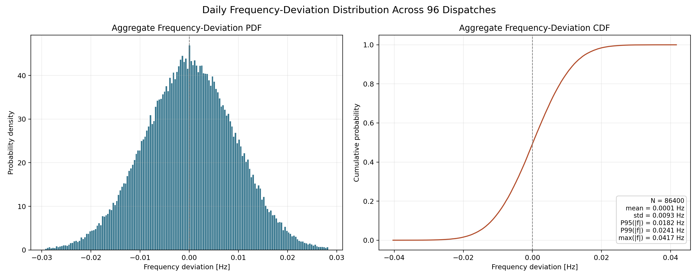
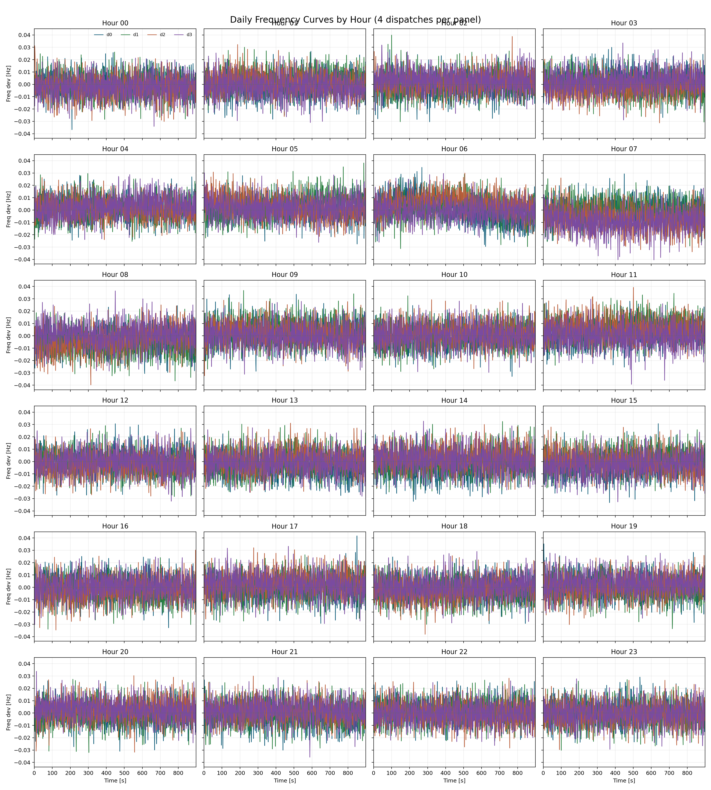
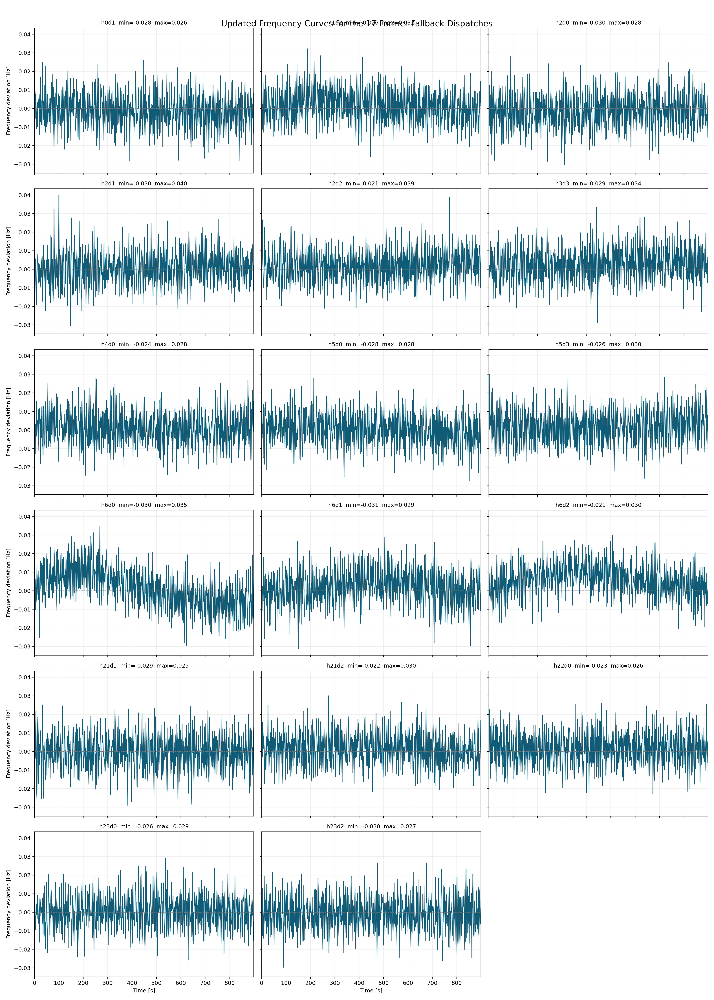
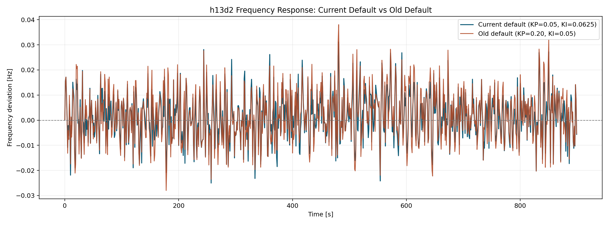
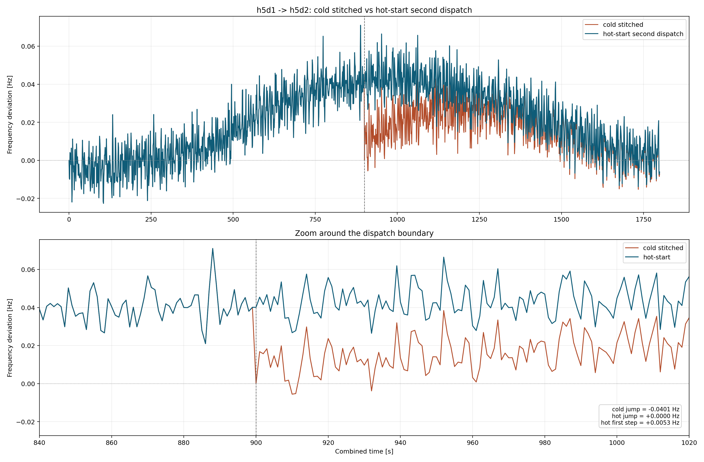
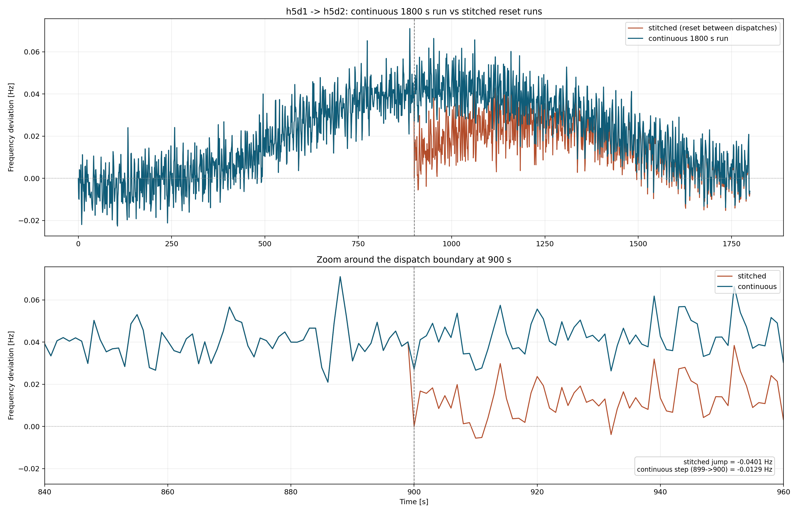

# deadband2

`deadband2` is an optimized derivative of the original `deadband` demo.
It keeps the original Illinois-200 test assets and notebooks, but updates the
runtime path so the study can be reproduced on the current stable ANDES/AMS
workflow with a cleaner dispatch-to-TDS interface.

## What Changed

- Stable-version migration:
  `PVD2 -> PVD1`, `ESD2 -> ESD1`, and the migrated dynamic sheets are adapted
  with the extra `fdbdu` column needed by the stable workflow.
- Renewable classification:
  wind and PV `PVD1` devices are split by configurable prefixes so the stable
  model path still tracks the two resource types separately.
- Dispatch-to-TDS replay:
  the main script can now either recompute dispatch from OPF or directly replay
  an existing dispatch JSON.
- Generalized runner:
  the workflow is no longer hard-wired to one case; it supports arbitrary
  `hXdY` dispatch intervals and full-day 96-dispatch batch studies.
- Initialization cleanup:
  `init_mode=first` is the default, `second` mode has been removed, and
  `cases/CurveInterp.csv` has PV clipped to nonnegative values to eliminate the
  unphysical negative-PV cold-start failures.
- AGC fixes and tuning:
  governor AGC saturation now preserves the command sign, and the current
  default study point is `agc_interval=4 s`, `KP=0.05`, `KI=0.0625`.
- Boundary continuity validation:
  new pairwise replay scripts compare cold-stitched dispatches against a
  memory hot-start second dispatch and against a true continuous 1800 s run.
- Standalone repo support:
  scripts now auto-detect a sibling `openandes` workspace, or you can point to
  one explicitly with `OPENANDES_WORKSPACE=/path/to/openandes`.

## Why This Fork Exists

The original demo had a few practical issues when replayed on the stable stack:

1. Cold-starting from dispatch-interval OPF averages often created an
   unrealistic initial frequency offset.
2. Switching initialization to the first second of the interval made the start
   point more physical, but exposed negative PV values in `CurveInterp.csv`.
3. Those negative PV samples were produced near dawn/dusk and at low-PV periods
   after interpolation plus Gaussian noise, which could trigger TDS init
   failures.
4. The legacy `PVD2` / `ESD2` branch path no longer matched the current stable
   ANDES model set.

`deadband2` fixes those issues directly rather than relying on workaround
initialization modes.

## Repository Layout

- `cases/`: test cases, dispatch curves, and migrated stable dynamic files
- `scripts/`: single-dispatch, full-day, sweep, and post-processing runners
- `notes/`: original notebooks kept for study context
- `results/published/`: representative published figures from the repaired demo

## Environment

This repository does not vendor ANDES/AMS itself. It expects one of these:

1. A sibling `openandes` workspace that contains `andes/` and `ams/`
2. `OPENANDES_WORKSPACE` pointing to such a workspace
3. A Python environment where compatible `andes` and `ams` packages are already
   importable

Example:

```bash
export OPENANDES_WORKSPACE=/path/to/openandes
source /path/to/openandes/.venv-deadband/bin/activate
```

## Usage

Run a single dispatch by recomputing OPF first:

```bash
python scripts/run_dispatch_tds.py \
  --hour 13 \
  --dispatch 2 \
  --agc-interval 4 \
  --kp 0.05 \
  --ki 0.0625 \
  --init-mode first
```

Replay an existing dispatch JSON:

```bash
python scripts/run_dispatch_tds.py \
  --dispatch-json path/to/h13d2_dispatch.json \
  --agc-interval 4 \
  --kp 0.05 \
  --ki 0.0625 \
  --init-mode first
```

Run the full 96-dispatch daily study:

```bash
python scripts/run_day_dispatch_tds.py \
  --agc-interval 4 \
  --kp 0.05 \
  --ki 0.0625 \
  --init-mode first \
  --retry-init-mode dispatch
```

Sweep AGC PI gains for one dispatch:

```bash
python scripts/sweep_dispatch_tds.py \
  --dispatch-json path/to/h13d2_dispatch.json \
  --agc-interval 4 \
  --init-mode first
```

## Published Results

### Daily 96-dispatch study

Published run:

- 24 hours
- 4 dispatches per hour
- 900 s TDS per dispatch
- `agc_interval = 4 s`
- `KP = 0.05`
- `KI = 0.0625`
- `init_mode = first`

Outcome:

- `96/96` dispatches succeeded
- `0` retries were needed after PV clipping
- aggregate `max(|f|) = 0.0417 Hz`
- aggregate `P95(|f|) = 0.0182 Hz`
- aggregate `P99(|f|) = 0.0241 Hz`





The 17 dispatches that previously needed fallback now complete under pure
`first` initialization after repairing the PV curve:



### `h13d2` parameter comparison

For `h13d2`, the current default (`KP=0.05`, `KI=0.0625`) performs better than
the older default (`KP=0.20`, `KI=0.05`) in this repaired setup:

- current default `abs_mean = 0.00737 Hz`
- old default `abs_mean = 0.00821 Hz`
- current default `max = 0.0311 Hz`
- old default `max = 0.0380 Hz`



Supporting CSVs are stored in `results/published/`.

### `h5d1 -> h5d2` dispatch-boundary continuity check

After the stable migration and PV-curve repair, one more workflow issue became
clear: stitching two adjacent dispatches from separate cold starts can still
inject a non-physical frequency reset at the 15-minute boundary.

To isolate that effect, this repo now includes two additive validation scripts:

- `scripts/compare_dispatch_pair_hotstart.py`
  reuses the terminal state of the first dispatch and starts the second
  dispatch from memory instead of from a fresh dynamic initialization.
- `scripts/run_dispatch_pair_continuous.py`
  runs the two dispatch intervals as one 1800-second continuous simulation and
  compares that trace against the cold-stitched baseline.

The published figures in this subsection intentionally use the first
`h5d1 -> h5d2` continuity experiment, where the AGC was lighter
(`agc_interval=4 s`, `KP=0.03`, `KI=0.01`, `init_mode=first`) so the boundary
artifact is easier to see. Under that setup, the published check shows:

- cold-stitched boundary jump: `-0.04010 Hz`
- memory hot-start boundary jump: `0.00000 Hz`
- continuous `899 s -> 900 s` step: `-0.01292 Hz`

These results show that the cold-stitched zero reset is a workflow artifact,
while the continuous run preserves the actual dynamic step between dispatches.

Reproduce the published 5h pair with:

```bash
python scripts/run_dispatch_tds.py \
  --hour 5 \
  --dispatch 1 \
  --results-dir results/generated/h5_pair \
  --label h5d1

python scripts/run_dispatch_tds.py \
  --hour 5 \
  --dispatch 2 \
  --results-dir results/generated/h5_pair \
  --label h5d2

python scripts/compare_dispatch_pair_hotstart.py \
  --first-dispatch-json results/generated/h5_pair/h5d1_dispatch.json \
  --second-dispatch-json results/generated/h5_pair/h5d2_dispatch.json \
  --first-cold-csv results/generated/h5_pair/h5d1_frequency.csv \
  --second-cold-csv results/generated/h5_pair/h5d2_frequency.csv \
  --kp 0.03 \
  --ki 0.01 \
  --results-dir results/generated/h5_pair \
  --label h5d1_h5d2_kp003_ki001_statehot

python scripts/run_dispatch_pair_continuous.py \
  --first-dispatch-json results/generated/h5_pair/h5d1_dispatch.json \
  --second-dispatch-json results/generated/h5_pair/h5d2_dispatch.json \
  --first-cold-csv results/generated/h5_pair/h5d1_frequency.csv \
  --second-cold-csv results/generated/h5_pair/h5d2_frequency.csv \
  --kp 0.03 \
  --ki 0.01 \
  --results-dir results/generated/h5_pair \
  --label h5d1_h5d2_continuous_1800s_kp003_ki001
```

Published figures:





## Notes

- `cases/CurveInterp.csv` in this repo is the repaired version with PV clipped
  to nonnegative values.
- This repository is based on the earlier `deadband` demo and is intended as an
  optimized follow-on branch.
- The original `deadband` README carried an all-rights-reserved/proprietary
  notice. Treat this repository as an internal derivative unless upstream
  licensing is clarified.
